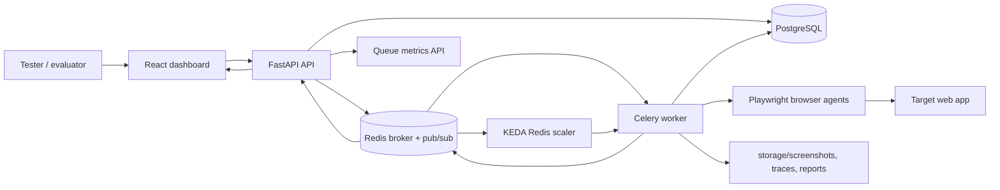

# BugSwarm Architecture

## Runtime Flow

1. A user creates a project or loads the BuggyShop demo project.
2. The backend stores project scope, AI provider settings, and run configuration.
3. Optional target auth profiles store login selectors, usernames, encrypted passwords, or storage-state paths.
4. Starting a test run creates agent rows and queues Celery jobs with the selected auth profile.
5. Worker agents apply target auth, explore in-scope pages with Playwright, capture screenshots/logs, and persist evidence.
6. The AI generation layer creates test cases from page evidence when providers are available, or falls back to deterministic seeded tests.
7. Detection rules turn HTTP errors, console errors, network failures, blank pages, crashes, loading stalls, and interaction failures into bug records.
8. The bug validation council reviews bug evidence, votes on validity, classifies severity, and stores provider responses.
9. Replay tasks re-run stored replay steps and attach per-step screenshots.
10. The backend exposes Redis queue-depth JSON and Prometheus metrics for production autoscaling signals.
11. KEDA can scale the worker deployment from Redis list depth, while the dashboard shows the same recommended replica count.
12. The dashboard polls APIs and listens to WebSocket events for live progress.

## Phase 8 Demo Path

Run the stack with Docker Compose, register a user, open Projects, and load the BuggyShop demo target. Start a run with desktop and mobile viewports. Expected findings include a broken product link, checkout HTTP 500, console error, invalid-email form behavior, and order history loading stall.
